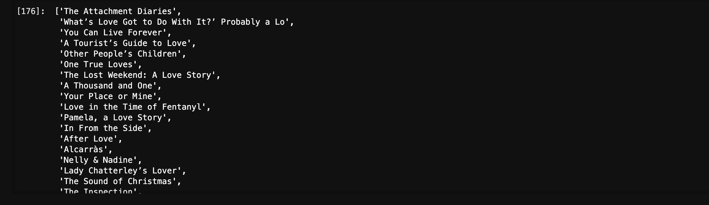
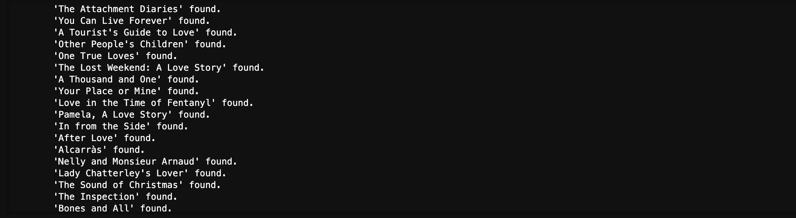

# data-sourcing-challenge
Week 6 Challenge

# Functionality:
This application queries the New York Times API movie reviews based on filter criteria and returns 200 JSON results into a list. Those results are lightly transformed to isolate the title and extract keywords. Those results are then placed into a dataframe and the titles are used to feed a query into two The Movie Database APIs. The application first loops through the titles and requests the movie id. Once the id is determined, it further requests details via a second API endpoint to obtain various information such as genres, spoken languages, and production countries for each title. These JSON results are then converted to a dataframe. The applications then merges the two dataframes into one dataframe and performs data clean up. Once complete, the application produces the final output, which is a csv file. 

 

# Approach:
The approach consisted of three steps.
1. Query and obtain the NYT reviews list using the filter criteria and their API. Store these results in a dataframe and create a list to pass in step 2.
2. Make the first of two TMDB calls looping through the titles list from the NYT in order to get the id, one movie at a time. Then, within the same loop, make a second call with a different NYT API to obtain details for each movie id. Store these results in a list and convert to a dataframe.
3. Merge the two dataframes into one and perform clean up tasks. Once clean, export the merged dataframe to a csv file.

# Summary of Findings:
The NYT data produced 200 movie reviews based upon the filter criteria, which was set to 'love'. Once those review titles were passed to TMDB, 124 matching movies were returned. In general, drama and romance dominated the genres while English was the dominant spoken language. 

# Plagerism Statement:
No specific code was copied but the sources below were referenced for examples and syntax. In addition, this challenge required collaboration with other students via Slack to understand how they were interpreting the module directions.

# Sources:

Applying lambda row on multiple columns pandas. (n.d.). Stack Overflow. Retrieved April 4, 2024, from https://stackoverflow.com/questions/51080174/applying-lambda-row-on-multiple-columns-pandas

Harrison, M. (2021). Effective Pandas: Patterns for Data Manipulation. Matt Harrison.

Lutz, M. (2013). Learning python: Powerful object-oriented programming. " O'Reilly Media, Inc.".

